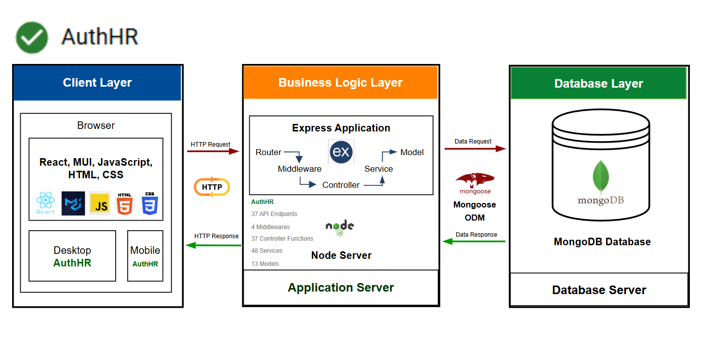
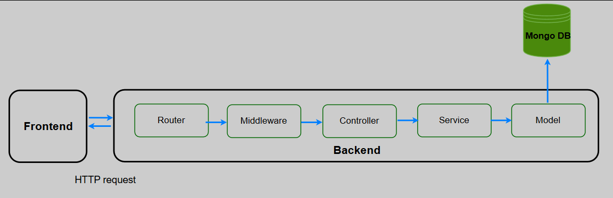
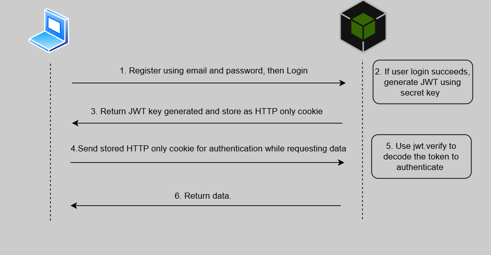

# AuthHR
Inspired by real-world workplace challenges, this full-stack Human Resource Management (HRM) application is built to close the communication gap between HR teams and employees. Prioritizing usability, security, and workflow efficiency, the platform streamlines processes such as leave applications, relocation requests, and resignation submissions and approvals.

## Table of Contents
- [Tech Stack](#tech-stack)
- [Feature Overview](#feature-overview)
- [Design Pattern](#design-pattern)
- [Security](#security)
- [API endpoints / Routes](#api-endpoints--routes)
- [Middlewares](#middlewares)
- [Controllers](#controllers)
- [Services](#services)
- [Deployment](#deployment)

## Tech Stack

### Frontend 
- React 
- Material UI
- React Router
- JavaScript

### Backend 
- Node.js
- Express.js
- MongoDB
- Mongoose
- JOI

## Feature Overview

### 1.Role-based access control  
Access is precisely tailored for employees and HR personnel based on their assigned roles. A middleware layer enforces these permissions by verifying whether the logged-in user's role is authorized to perform the requested action on the specified subject. It does so by querying the role-permission mappings: first retrieving the user's role, then fetching the associated permissions, and finally checking if the current request matches any allowed action-subject pair. Only if the permission is verified does the request proceed from the router to the controller; otherwise, access is denied.

### 2.Authentication and Authorization
Secure login and registration system using JWT tokens to protect user data and restrict access.

### 3.Secure Password Hashing
User passwords are protected using industry-standard bcrypt hashing. This ensures that raw passwords are never stored in the database, enhancing security against data breaches. By incorporating salting and multiple hashing rounds, bcrypt makes it computationally expensive for attackers to reverse-engineer passwords, safeguarding user credentials even if the database is compromised.

### 4.User Session Management
Persistent login sessions using HTTP-only cookies for a seamless user experience.

### 5.Responsive Mobile first frontend
Responsive, mobile first approcah of development taken. Your dashboard adapts to the device you are on and gives you smooth, seamless experience.
The frontend is built with a mobile-first approach, ensuring the dashboard adapts seamlessly to any device. Whether on a phone or desktop, users enjoy a smooth and consistent experience tailored to their screen size.

### 6.Approval Workflow
HR dashboard to review, approve, or reject requests made by employees efficiently.

## DESIGN PATTERN 

### 1.Layered Architecture
The backend is structured using a clean and modular layered architecture, promoting a clear separation of concerns. Each layer has a distinct responsibility—controllers handle incoming requests and responses, routers manage endpoint definitions, middlewares provide cross-cutting functionality such as authentication, services encapsulate business logic, and database modules manage data access and persistence. This approach enhances code readability, testability, scalability, and maintainability.

### 2.Lazy Loading
To optimize performance and reduce initial load time, the application implements lazy loading for various sections using React’s built-in lazy() function. Instead of bundling all components into the main JavaScript file, feature-specific components are loaded on demand—only when they are needed based on user interaction or route activation.

This approach not only improves initial page load speed but also reduces the app's memory footprint. By breaking down the code into smaller chunks, the app delivers a faster, more responsive experience—especially beneficial in large-scale applications with multiple feature modules.

React’s lazy() is paired with Suspense to handle the loading state gracefully, displaying fallback UI - Shimmer UI while the component is being fetched.

### 3.Custom Hooks
The application leverages custom React hooks to encapsulate and reuse logic related to API calls and data transformations—particularly for the HR analytics section. These hooks abstract away repetitive logic such as fetching, and error handling, making the components cleaner and easier to maintain. Additionally, data processing tasks—like aggregating metrics, or filtering datasets—are handled within these hooks, ensuring a clear separation between business logic and UI.

## SECURITY 

### 1. Password Hashing
User passwords are securely hashed using bcrypt, a strong hashing algorithm, ensuring that passwords are never stored in plain text. This enhances security by making it computationally infeasible for attackers to recover the original passwords, even in the event of a data breach.

### 2. JWT Authentication
The application employs JSON Web Tokens (JWT) for secure, stateless authentication, ensuring that user credentials are safely transmitted and validated. This mechanism guarantees that sensitive data remains protected during the authentication process.

## API endpoints / Routes
37 API Endpoints built to seamlessly connect client to the backend. These endpoints are divided into three routes - auth, hr and user. 

### 1. auth.routes.js 
/register [register new user]  
/login [login registered user]  
/logout [logout or clear http cookie of logged in user]  
/loginstatus [returns user’s status]  

### 2. hr.routes.js
/all-user-details [returns all available users ] 
/pending-leaves [return all pending leave requests] 
/pending-relocations [return all pending relocation requests] 
/pending-resignations [return all pending resignation requests] 
/current-month-resignations [returns current month resignation for analytics purpose] 
/create-announcement [create new announcement] 
/announcements [get all announcement] 
/update-announcement [edit/update existing announcement] 
/delete-announcement [delete existing announcement] 
/update-leave-bal [updates available leave balance count] 
/update-leave-status [review leave request] 
/update-relocation-status [review relocation request] 
/update-resignation-status [review resignation request] 
/update-user-location [update user’s location] 
/update-user-details [update user’s details] 
/delete-all-user-data/:userId [delete user and user’s details] 

### 3. user.route.js
/details [returns logged in user details] 
/request-history [return logged in user’s request history]  
/leaveBal [returns logged in user’s leave balance] 
/updateLeaveBal [updates logged in user’s leave balance] 
 /leave [submit leave request] 
/leave-applications [returns logged in user’s leave application history] 
/pending-leave-applications [returns logged in user’s pending leave applications] 
/relocate [submit relocation request] 
/relocationquestionnaire [get relocation questionnaire] 
/relocationresponses [submit relocation responses for relocation questionnaire] 
/relocation [returns logged in user’s relocation requests history] 
/pending-relocation [returns logged in user’s pending requests] 
/resign [ submit resignation] 
/questionnaire [get resignation questionnaire] 
/responses [submit resignation responses for relocation questionnaire] 
/resignation [returns logged in user’s resignation requests history] 
/pending-resignation [returns logged in user’s pending resignation request] 

## Middlewares
4 essential middleware functions have been developed and reused across critical parts of the application

### 1. authorizeJwt(req, res, next)
Verifies the user's JWT by extracting the token from cookies and attaches the authenticated user object to the request.

### 2. dateValidation(req, res, next)
Ensures that the requested date is not a national holiday or a weekend.

### 3. validateSchema(req, res, next) 
Validates incoming request data against predefined Joi schemas.

### 4. validateRolePermission(req, res, next)
Enforces role-based access control by verifying if the user has permission to perform the requested action.

## Controllers
37 Controller Functions are built for handling incoming requests and sending responses back to the client. These functions are divided into 3 Controller JS files -

### 1. auth.controller.js 
register() [register new user]  
login() [login registered user] 
logout() [clear cookie, logout user] 
loginstatus() [return user details if jwt token still valid] 

### 2. hr.controller.js
getAllUsers() [gets all available users] 
getPendingLeaves() [gets all pending leave requests] 
getPendingRelocations() [gets all pending relocation requests] 
getPendingResignations() [gets all pending relocation resignations] 
getCurrMonthResignations() [gets current month resignations for analytics ] 
createAnnouncement() [creates announcement] 
getAnnouncements() [gets all announcements] 
updateAnnouncement() [updates announcement] 
deleteAnnouncement() [deletes announcement] 
updateLeaveBal() [updates leave balance count] 
updateLeaveStatus() [updates leave status – approved/rejected] 
updateRelocationStatus() [updates relocation status – approved/rejected] 
updateUserLocation() [updates user location] 
updateResignationStatus() [updates resignation status – approved/rejected] 
updateUser() [updates user details] 
deleteAllUserData() [removes user and associated data in a single mongoose transaction] 

### 3.user.controller.js
userDetails() [gets user details by user id] 
getRequestHistoryByUserId() [gets user’s request history by user id] 
getLeaveBalByUserId() [gets leave balance by user id] 
leave() [submits leave request] 
updateLeaveBal() [updates user’s leave balance] 
getLeavesByUserId() [gets leave request history by user id] 
getPendingLeavesByUserId() [gets pending leaves by user id] 
relocate() [submits relocation request] 
relocationQuestionnaire() [gets relocation questionnaire] 
submitRelocationResponse() [submit response to relocation questionnaire] 
getRelocationByUserId() [get relocation request history by user id] 
getPendingRelocationByUserId() [get pending relocation requests by user id] 
resign() [submit resignation request] 
questionnaire() [gets resignation questionnaire] 
submitResponse() [submit response to resignation questionnaire] 
getResignationByUserId() [get relocation request history by user id] 
getPendingResignationByUserId() [get pending resignation requests by user id] 

## SERVICES
48 Services built to seamlessly carry out business logic, connect to MongoDB and return requested data back to the controller and sub-sequently to the client. These services are divided into 3 Services JS files - 

### 1. auth.service.js 
generatePasswordHash() [generates hashed password from plain text input using bcrypt] 
comparePasswordHash() [compares input password and hashed password] 
generateJwt() [creates Jwt using Jwt.sign()] 
verifyJwt() [verifies jwt using Jwt.verify()]  

### 2. hr.service.js
getAllUsers() [gets all documents from users collection] 
getPendingLeaves() [gets all pending leave documents from leaves collection] 
getPendingRelocations() [gets all pending relocation documents from relocations collection] 
getPendingResignations() [gets all pending resignation documents from resignations collection] 
getCurrMonthResignations() [gets current month’s resignations from resignations collection] 
createAnnouncement() [creates a new announcement document in the announcements collection] 
getAnnouncements() [gets all announcement documents from announcements collection] 
updateAnnouncement() [updates a document in the announcements collection] 
deleteAnnouncement() [deletes a document from the announcements collection] 
updateLeaveBal() [updates leave balance in a document in the users collection] 
updateLeaveStatus() [updates leave status in a document in the leaves collection] 
updateRelocationStatus() [updates relocation status in a document in the relocations collection] 
updateUserLocation() [updates location in a document in the users collection] 
updateResignationStatus() [updates resignation status in a document in the resignations collection] 
updateUser() [updates  multiple fields in a document in the users collection] 
deleteUserById() [deletes a document in the users collection] 
deleteUserRolesByUserId() [deletes a document in the userroles collection] 
deleteLeavesByUserId() [deletes a document in the leaves collection] 
deleteRelocationsByUserId() [deletes a document in the relocations collection] 
deleteRelocationRespByUserId() [deletes a document in the relocationresponses collection] 
deleteResignationsByUserId() [deletes a document in the resignations collection] 
deleteResignationRespByUserId() [deletes a document in the userresponses collection] 
getRolePermissions() [gets documents from rolepermissions collection by role Id] 
getPermissions() [gets documents from persmissions collection by permission ids] 

### 3. user.service.js
create() [creates a document in the users collection] 
createUserRole() [creates a document in the userroles collection] 
getUserRoleMapping() [get documents from userroles collection by user id] 
findByUsername() [get documents from users collection by user name] 
findByUserId() [get documents from users collection by user id] 
getRole() [get documents from roles table by role id] 
resign() [creates a document in the resignations collection] 
submitResponse() [creates a document in the userresponses collection] 
getQuestions() [gets documents from questionnaire collection] 
getResignationByUserId() [aggregates and returns data from resignations, users and userresponses collections] 
getPendingResignationByUserId() () [aggregates and returns data from resignations, users and userresponses collections] 
relocate() [creates a document in the relocations collection] 
submitRelocationResponse() [creates a document in the relocationresponses collection] 
getRelocationQuestions() [gets documents from relocationquestionnaire collection] 
getRelocationByUserId() [aggregates and returns data from relocations, users and relocationresponses collections] 
getPendingRelocationByUserId() [aggregates and returns data from relocations, users and relocationresponses collections] 
leave() [creates a document in the leaves collection] 
updateLeaveBal() [updates leave balance in a document in the users collection] 
getleavesByUserId() [aggregates and returns data from leaves and users collections] 
getPendingleavesByUserId() [aggregates and returns data from leaves and users collections] 

## DEPLOYMENT

### Backend
The application's backend is hosted on Render, providing a reliable and scalable cloud platform for deployment. A Node.js server powers the backend, efficiently handling API requests and responses.

### Frontend
The frontend is deployed on Vercel, a fast and developer-friendly platform optimized for frontend frameworks like React. Vercel enables seamless CI/CD workflows, automatic deployments on code push, and delivers a globally distributed, high-performance user experience.

